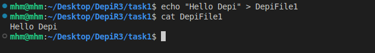
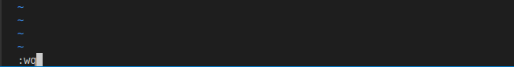
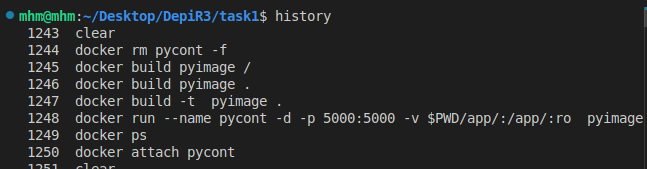

# Solution of Task 1

### Print Working Directory

> `pwd` command used to print working directory 
>> 

### Create and Delete Directory 

> 1. `mkdir` command used to create directories
> 2. `mkdir -p ` command used to create nested directories
>> 

> 2. `rmdir` command used to delete empty directory
> 3. `rm -r` command used to delete directory and its content
>> 

### Preview Data in File

> 1. `cat /etc/hostname`
> 2. `head -n 5 /etc/passwd`
> 3. `tail -n 5 /etc/passwd`
> 4. `more -n 5 /etc/passwd`
>> 

### File Management

> 1. `touch` command used to create a file and update its timestamps
>> 

> 2. `echo "txt">file` command used to add content to file
>> 

> 3. `vim file` edit file content using *vim* text editor
>> 
>> 
>> 
>> 

> 4. `cp src dst` copy from source to destination 
> 5. `mv src dst` move content from source to destination
>> 

> 6. `mv file-old-name file-new-name` rename a file or directory
>> 

### Search in File or Directory

> 1. `grep` command used to search in file or directory
>> 

> 2. `find`  command used to locate files and directories
>> 

### `history` and `date` command
>
>> 
>> 

### Change Permissions

> `chmod` command used to change permissions
>> 1. `chmod 764 fileORdir`
>> 2. `chmod u-r,g-w,o+r fileORdir`
>> 

### Adding User and Switch to it

> `useradd` command to add user *or* `adduser` command
> `passwd user` change user password
>> 

> `su` switch to user
>> 

### Deleting User

> `userdel` command used to delete user
>> 

### alias and unalias command

> `alias` used to alias command
> `unalias` used to unalias command
>> 
