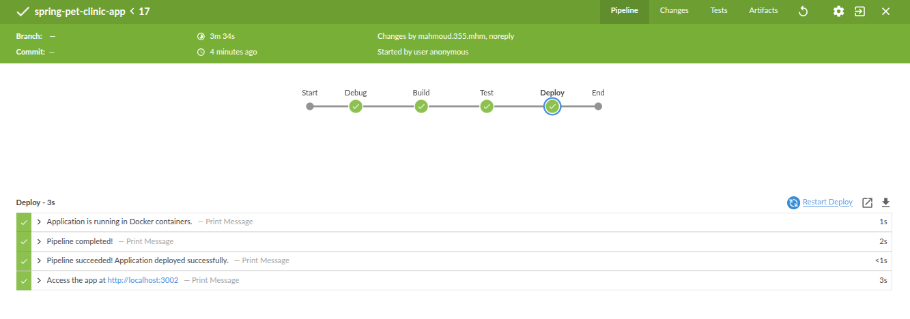

# Task 10 Solution

## Repository Structure 

```
└── 📁Task10
    └── 📁Screenshots
    ├── docker-compose.yml
    ├── Jenkinsfile
    └── README.md
```


## Create `docker-compose.yml` file

* __Jenkins will use this file within the pipeline to build and deploy the application.__

```yaml

services:
  db:
    image: mysql
    container_name: db
    environment:
      - MYSQL_ROOT_PASSWORD=root
      - MYSQL_DATABASE=petclinic
      - MYSQL_USER=petclinic
      - MYSQL_PASSWORD=petclinic
    networks:
      - app_network
    healthcheck:
      test: ["CMD", "mysqladmin", "ping", "-h", "localhost", "-u", "root", "-p$$MYSQL_ROOT_PASSWORD"]
      interval: 15s
      timeout: 5s
      retries: 3
  app:
    image: mhmdocker1/spring-petclinic:latest
    container_name: sp_app
    environment:
      - SPRING_PROFILES_ACTIVE=mysql
      - SPRING_DATASOURCE_URL=jdbc:mysql://db:3306/petclinic
      - SPRING_DATASOURCE_USERNAME=petclinic
      - SPRING_DATASOURCE_PASSWORD=petclinic
    ports:
      - 3002:8080
    networks:
      - app_network
    depends_on:
      db:  
        condition: service_healthy
           
networks:
  app_network:
    name: app_network
    driver: bridge

```

* __The image mhmdocker1/spring-petclinic:latest built and pushed to Docker Hub before creating the docker-compose.yml and Jenkinsfile.__

## Create the Jenkinsfile

```groovy
pipeline {
    agent any
    
    stages {
        stage('Debug') {
            steps {
                script {
                    sh '''
                    echo "Current Directory: $(pwd)"
                    echo "Listing files:"
                    ls -la
                    '''
                }
            }
        }
        stage('Build') {
            steps {
                echo 'Building Spring Pet Clinic app...'
                script {
                    sh '''
                    docker-compose -f ./Task10/docker-compose.yml up -d
                    '''
                }
            }
        }
        
        stage('Test') {
            steps {
                script {
                    sh '''
                    docker ps | grep sp_app || (echo "App container not found" && exit 1)
                    docker ps | grep db || (echo "DB container not found" && exit 1)
                    '''
                }
            }
        }
        
        stage('Deploy') {
            steps {
                echo 'Application is running in Docker containers.'
            }
        }
    }
    
    post {
        always {
            echo 'Pipeline completed!'
        }
        
        success {
            echo 'Pipeline succeeded! Application deployed successfully.'
            echo "Access the app at http://localhost:3002"
        }
        
        failure {
            echo 'Pipeline failed! Check logs for errors.'
            script {
                sh 'docker-compose logs --tail=20'
            }
        }
    }
}
```

* __Push this file to the repository containing the docker-compose.yml file.__


## Configure the pipeline in jenkins

* __Jenkins → spring-pet-clinic-app → Configure__


## Build the pipeline 

* __Jenkins → spring-pet-clinic-app → Build Now__



## Access the app

* `localhost:3002`


