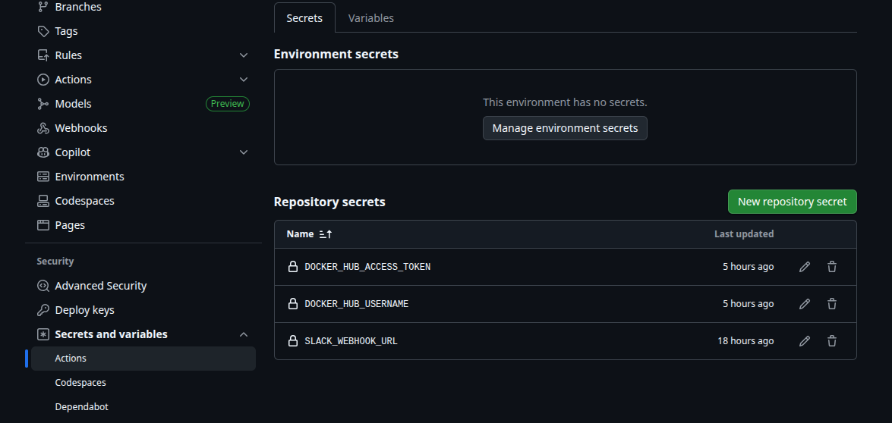

# Task 12 Solution

* github_action pipeline for deploying spring-petclinc app with mysql database and monitoring services (prometheus, grafana)

## Required files 

1. [docker-compose-app,db.yml](./docker-compose-app,db.yml) : for running spring-petclinic app with mysql db

2. [docker-compose-monitoring.yml](./docker-compose-monitoring.yml) : for running prometheus and grafana

3. [Dockerfile](./Dockerfile) : for building the spring-petclinic image

4. [prometheus.yml](./prometheus.yml) : for defining scrape targets and rules.


## github_action pipeline

```yaml
name: Deploy Petclinic and Monitoring Services
on:
  push: 
    paths:
      - 'Task12/docker-compose-app,db.yml'
      - 'Task12/docker-compose-monitoring.yml'
      - 'Task12/prometheus.yml'
      - 'Task12/Dockerfile'
    branches:
      - main  
  workflow_dispatch:  

jobs:
  Build_Push_Docker_Image:
    runs-on: self-hosted 
    steps:
    - name: Checkout code
      uses: actions/checkout@v4
    - name: Log in to Docker Hub
      uses: docker/login-action@v2
      with:
        username: ${{ secrets.DOCKER_HUB_USERNAME }}
        password: ${{ secrets.DOCKER_HUB_ACCESS_TOKEN }}
    - name: Build and Push Docker Image
      uses: docker/build-push-action@v4
      with:
        context: ./Task12
        file: ./Task12/Dockerfile
        push: true
        tags: ${{ secrets.DOCKER_HUB_USERNAME }}/github_spring-petclinic:${{ github.sha }}

    - name: Notify Slack on Success
      if: success()
      uses: rtCamp/action-slack-notify@v2
      env:
        SLACK_WEBHOOK: ${{ secrets.SLACK_WEBHOOK_URL }}
        SLACK_CHANNEL: github_action
        SLACK_COLOR: good
        SLACK_MESSAGE: |
          SpringPetclinic Image build successful .
          Commit: ${{ github.sha }}
          Details: ${{ github.server_url }}/${{ github.repository }}/actions/runs/${{ github.run_id }}
        
    - name: Notify Slack on Failure
      if: failure() 
      uses: rtCamp/action-slack-notify@v2
      env:
        SLACK_WEBHOOK: ${{ secrets.SLACK_WEBHOOK_URL }}
        SLACK_CHANNEL: github_action
        SLACK_COLOR: danger
        SLACK_MESSAGE: |
          SpringPetclinic Image Failed to Build.
          Commit: ${{ github.sha }}
          Details: ${{ github.server_url }}/${{ github.repository }}/actions/runs/${{ github.run_id }}


  deploy-petclinic:
    runs-on: self-hosted
    needs: Build_Push_Docker_Image  # job runs after the Docker image has been built and pushed to docker hub.

    steps:

    - name: Checkout Repository  # Clones the repository onto the runner.
      uses: actions/checkout@v4

    - name: Down existing containers
      run: docker compose -f Task12/docker-compose-app,db.yml down || true
        
    - name: Run Spring Petclinic application
      run: docker compose -f Task12/docker-compose-app,db.yml up -d
        
    - name: Check running containers
      run: docker compose -f Task12/docker-compose-app,db.yml ps
        
    - name: Notify Slack on Success
      if: success()
      uses: rtCamp/action-slack-notify@v2
      env:
        SLACK_WEBHOOK: ${{ secrets.SLACK_WEBHOOK_URL }}
        SLACK_CHANNEL: github_action
        SLACK_COLOR: good
        SLACK_MESSAGE: |
          SpringPetclinic Application is running.
          Commit: ${{ github.sha }}
          Details: ${{ github.server_url }}/${{ github.repository }}/actions/runs/${{ github.run_id }}
        
    - name: Notify Slack on Failure
      if: failure() 
      uses: rtCamp/action-slack-notify@v2
      env:
        SLACK_WEBHOOK: ${{ secrets.SLACK_WEBHOOK_URL }}
        SLACK_CHANNEL: github_action
        SLACK_COLOR: danger
        SLACK_MESSAGE: |
          SpringPetclinic Application Failed to run.
          Commit: ${{ github.sha }}
          Details: ${{ github.server_url }}/${{ github.repository }}/actions/runs/${{ github.run_id }}

  deploy-monitoring:
    runs-on: self-hosted
    needs: deploy-petclinic
    
    steps:

    - name: Checkout Repository
      uses: actions/checkout@v4
  
    - name: Down existing containers
      run: docker compose -f Task12/docker-compose-monitoring.yml down || true
        
    - name: Run monitoring applications
      run: docker compose -f Task12/docker-compose-monitoring.yml up -d
        
    - name: Notify Slack on Success
      if: success()
      uses: rtCamp/action-slack-notify@v2
      env:
        SLACK_WEBHOOK: ${{ secrets.SLACK_WEBHOOK_URL }}
        SLACK_CHANNEL: github_action
        SLACK_COLOR: good
        SLACK_MESSAGE: |
          Monitoring Applications are running 
          Commit: ${{ github.sha }}
          Details: ${{ github.server_url }}/${{ github.repository }}/actions/runs/${{ github.run_id }}
        
    - name: Notify Slack on Failure
      if: failure()
      uses: rtCamp/action-slack-notify@v2
      env:
        SLACK_WEBHOOK: ${{ secrets.SLACK_WEBHOOK_URL }}
        SLACK_CHANNEL: github_action
        SLACK_COLOR: danger
        SLACK_MESSAGE: |
          Monitoring Applications Failed to run.
          Commit: ${{ github.sha }}
          Details: ${{ github.server_url }}/${{ github.repository }}/actions/runs/${{ github.run_id }}

```


### triggers

```yaml
on:
  push:  
    paths:
      - 'Task12/docker-compose-app,db.yml'
      - 'Task12/docker-compose-monitoring.yml'
      - 'Task12/prometheus.yml'
      - 'Task12/Dockerfile'
    branches:
      - main  
  workflow_dispatch:  
```
* `push` event to `main` branch includes changes for specefic files listed in the `paths` section


* `workflow_dispatch: ` for manuall triggering

### runners

* `self-hosted` runner to access the application after running by the pipeline

* steps to create linux `self-hosted` runner

    repo settings -> actions -> runners -> copy the script similar to the script below.

```bash

# Create a folder
mkdir actions-runner && cd actions-runner

# Download the latest runner package
curl -o actions-runner-linux-x64-2.328.0.tar.gz -L https://github.com/actions/runner/releases/download/v2.328.0/actions-runner-linux-x64-2.328.0.tar.gz

# Extract the installer
tar xzf ./actions-runner-linux-x64-2.328.0.tar.gz

# Create the runner and start the configuration experience
./config.sh --url https://github.com/mhm355/DepiR3 --token "TOKEN"

# Last step, run it!
./run.sh

```

### Secrets

1. `DOCKER_HUB_USERNAME`

2. `DOCKER_HUB_ACCESS_TOKEN`: Docker Hub Personal Access Token with permissions write to repo.

login to dockerhub -> account settings -> personal access token -> generate new token -> login to github -> repo sttings -> secrets and varables -> actions -> new repo secret

    * 


3. `SLACK_WEBHOOK_URL:` : webhook URL for the Slack channel where receiving notifications.

slack api -> create new app -> enable incoming webhooks -> selecte channel -> copy url -> login to github -> repo sttings -> secrets and varables -> actions -> new repo secret




### Plugins


1. [actions/checkout@v4](https://github.com/marketplace/actions/checkout) : Clones the repository onto the runner.

2. [docker/login-action@v2](https://github.com/marketplace/actions/docker-login) : used to log in to a Docker registry

3. [docker/build-push-action@v4](https://github.com/marketplace/actions/build-and-push-docker-images) : for building and pushing a Docker image

4. [rtCamp/action-slack-notify@v2](https://github.com/marketplace/actions/slack-notify) : send notifications to a Slack channel

