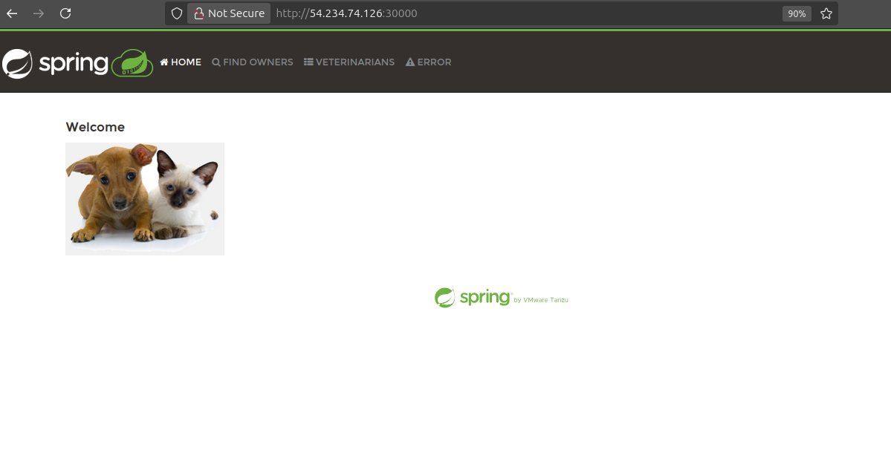

# Task 13 Solution

* Create spring-petclinic deployment and Service

# Create Deployment

```yaml

apiVersion: apps/v1
kind: Deployment
metadata: 
  name: petclinic
  labels:
    app: petclinic
spec:
  replicas: 3
  selector:
    matchLabels:
      app: petclinic
  template:
    metadata:
      labels:
        app: petclinic
    spec:
      containers:
        - name: petclinic
          image: mhmdocker1/spring-petclinic
          ports:
            - containerPort: 8080
```

# Create Service
```yaml

apiVersion: v1
kind: Service
metadata:
  name: petclinic
  labels:
    app: petclinic
spec:
  type: NodePort
  selector:
    app: petclinic
  ports:
    - port: 8080
      targetPort: 8080
      nodePort: 30000
```




