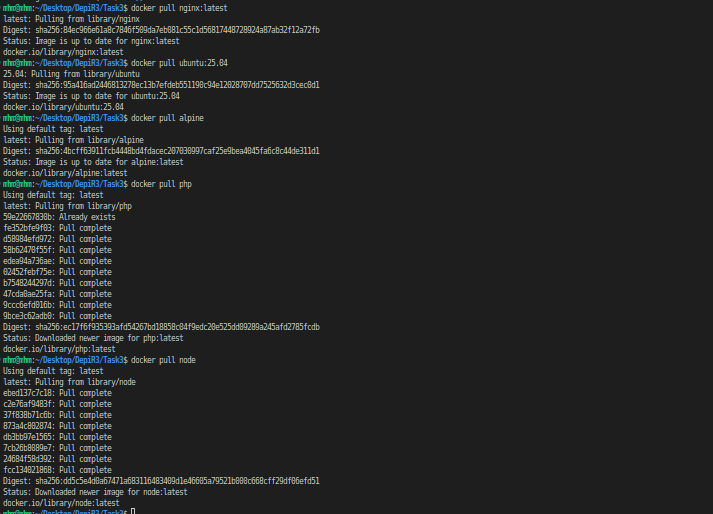
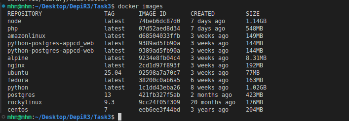
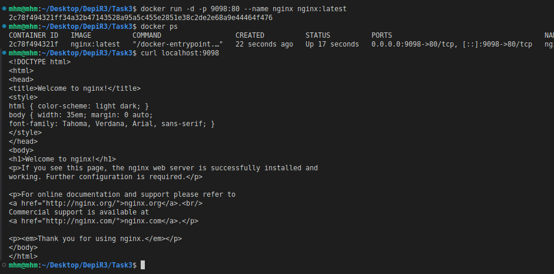
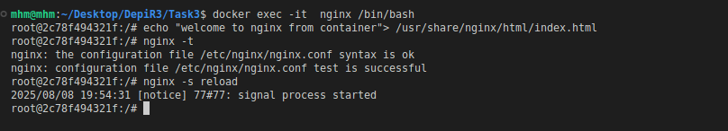
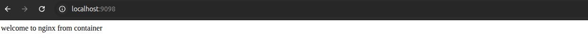
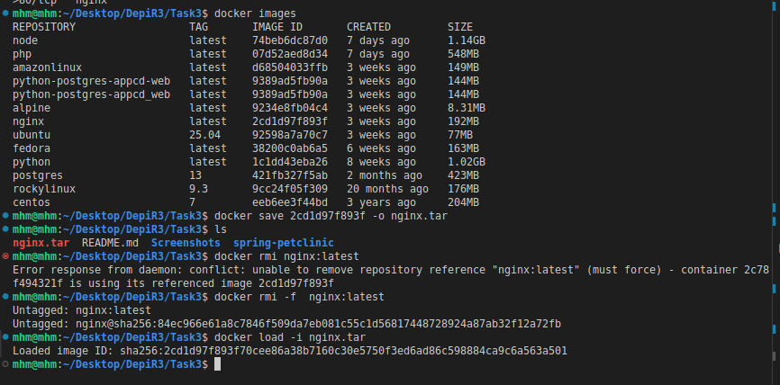
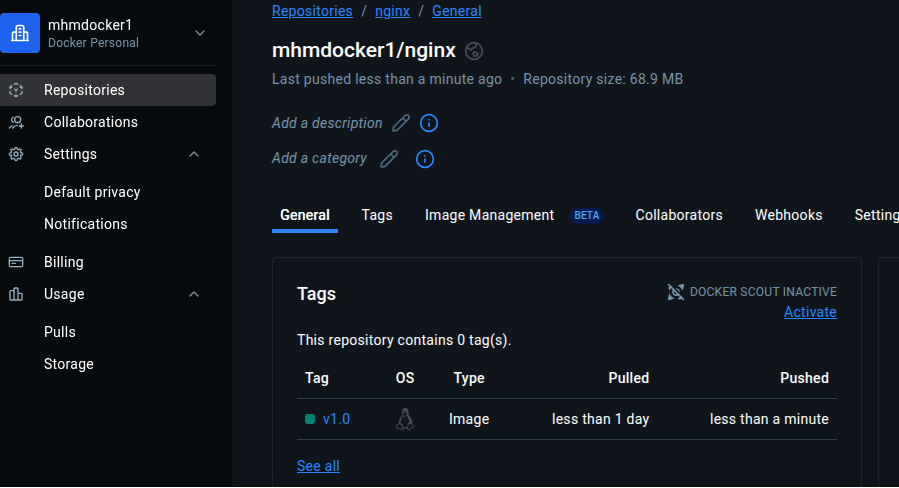

# Task3 Solution

## pull images

> nginx
`docker pull nginx:latest`

> ubuntu
`docker pull ubuntu:25.04`

> alpine
`docker pull alpine`

> php
`docker pull php`

> nodejs
`docker pull node`

* display the downloaded images

## Run Nginx Container

`docker run -d -p 9098:80 --name nginx nginx:latest`

* `-d` run the container in the background
* `-p 9098:80` maps port 80 inside nginx container to port 8080 on the host 
* `--name nginx` add name the container

## Edit nginx container

## Save and Load image

`docker save <image_id> -o <name.tar>`

`docker load -i <name.tar>`

## Create docker hub account and login

> [docker hub account](https://hub.docker.com/repositories/mhmdocker1)

> login 
`docker login -u mhmdocker1`

## tag and push to docker hub registory

`docker tag nginx:latest mhmdocker1/nginx:v1.0`

`docker push mhmdocker1/nginx:v1.0` 

