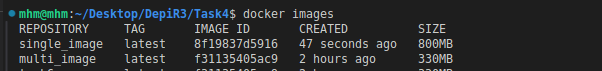

# Task 4 Solution

## single stage docker file

```
FROM eclipse-temurin:latest
WORKDIR /app
COPY ./spring-petclinic .
EXPOSE 8080
RUN ./mvnw package -DskipTests
ENTRYPOINT ["/bin/sh", "-c"]
CMD ["java -jar /app/target/*.jar"]
```

## multistage docker file
```
FROM eclipse-temurin:17-jdk as builder
WORKDIR /app
COPY ./spring-petclinic .
RUN ./mvnw package -DskipTests

FROM eclipse-temurin:17-jre
WORKDIR /app
COPY --from=builder /app/target/*.jar /app/app.jar
EXPOSE 8080
CMD ["java", "-jar", "app.jar"]
```
## .dockerignore file
```
git
Dockerfile*
README.md
.gitignore
Screenshots
```

## compare images size
