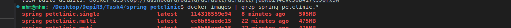

# Task4 Solution

## docker file with single layer

```
FROM openjdk:17-jdk-slim

WORKDIR /app

COPY . .

RUN apt-get update
RUN apt install -y curl
RUN apt clean

EXPOSE 8080

ENTRYPOINT [ "./mvnw", "spring-boot:run" ]

```

## docker file with multilayer
```

FROM openjdk:17-jdk-slim

ENV WORKDIR=/app

WORKDIR $WORKDIR

COPY target/spring-petclinic*.jar app.jar


RUN apt-get update && \
    apt-get clean && \
    rm -rf /var/lib/apt/lists/*

EXPOSE 8080

ENTRYPOINT [ "java" ,"-jar" , "app.jar" ]
```
## .dockerignore file
```
.git
.gitignore
Dockerfile*
!target/*
README.md
*.log
```

## compare images size
