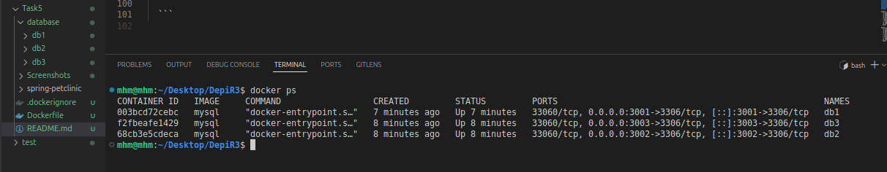
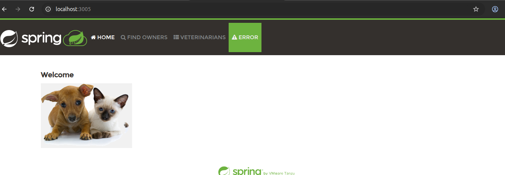
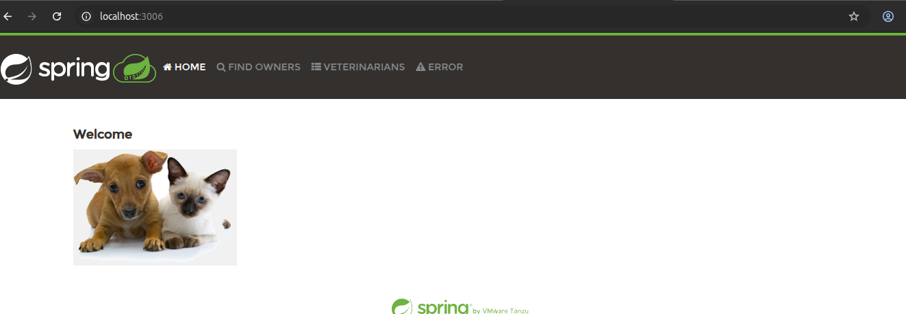
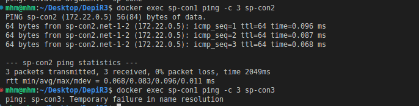

# Task 5 Solution

## Create Network
* create network `net-1-2` for container `sp-con1` and `sp-con2`
* create network `net-3` for container `sp-con3`
```bash
dokcer network create net-1-2
dokcer network create net-3
```
## Create Database Containers

* create database container `db1` for container `sp-con1`

* create database container `db2` for container `sp-con2`

* create database container `db3` for container `sp-con3`


```bash

docker run -d \
  -e MYSQL_USER=petclinic1 \
  -e MYSQL_PASSWORD=petclinic1 \
  -e MYSQL_ROOT_PASSWORD=root \
  -e MYSQL_DATABASE=petclinic1 \
  --network net-1-2 \
  --name db1 \
  -v $(pwd)/database/db1:/var/lib/mysql \
  -p 3001:3306 \
  mysql

docker run -d \
  -e MYSQL_USER=petclinic2 \
  -e MYSQL_PASSWORD=petclinic2 \
  -e MYSQL_ROOT_PASSWORD=root \
  -e MYSQL_DATABASE=petclinic2 \
  --network net-1-2 \
  --name db2 \
  -v $(pwd)/database/db2:/var/lib/mysql \
  -p 3002:3306 \
  mysql

docker run -d \
  -e MYSQL_USER=petclinic3 \
  -e MYSQL_PASSWORD=petclinic3 \
  -e MYSQL_ROOT_PASSWORD=root \
  -e MYSQL_DATABASE=petclinic3 \
  --network net-3 \
  --name db3 \
  -v $(pwd)/database/db3:/var/lib/mysql \
  -p 3003:3306 \
  mysql

  ```



## Create Image for the Application Containers
* building the image from Dockerfile
```
FROM eclipse-temurin:latest
WORKDIR /app
COPY ./spring-petclinic .
EXPOSE 8080
RUN ./mvnw package -DskipTests
ENTRYPOINT ["/bin/sh", "-c"]
CMD ["java -jar /app/target/*.jar"]
```

`docker build -t sp_image . `


## Create Application Containers

```bash
docker run -d \
  -e SPRING_PROFILES_ACTIVE=mysql \
  -e SPRING_DATASOURCE_URL=jdbc:mysql://db1:3306/petclinic1 \
  -e SPRING_DATASOURCE_USERNAME=petclinic1 \
  -e SPRING_DATASOURCE_PASSWORD=petclinic1 \
  --network net-1-2 \
  --name sp-con1 \
  -p 3004:8080 \
  sp_image

docker run -d \
  -e SPRING_PROFILES_ACTIVE=mysql \
  -e SPRING_DATASOURCE_URL=jdbc:mysql://db2:3306/petclinic2 \
  -e SPRING_DATASOURCE_USERNAME=petclinic2 \
  -e SPRING_DATASOURCE_PASSWORD=petclinic2 \
  --network net-1-2 \
  --name sp-con2 \
  -p 3005:8080 \
  sp_image

docker run -d \
  -e SPRING_PROFILES_ACTIVE=mysql \
  -e SPRING_DATASOURCE_URL=jdbc:mysql://db3:3306/petclinic3 \
  -e SPRING_DATASOURCE_USERNAME=petclinic3 \
  -e SPRING_DATASOURCE_PASSWORD=petclinic3 \
  --network net-3 \
  --name sp-con3 \
  -p 3006:8080 \
  sp_image
```




## Communicate between Containers

* `sp-con1` and `sp-con2` in the same network `net-1-2`
* `sp-con1` ip is `172.22.0.4`
* `sp-con2` ip is `172.22.0.5`

* `sp-con3` is connected to different network `net-3`

> install `ping` command 

```bash
docker exec sp-con1 apt-get update
docker exec sp-con1 apt-get install -y iputils-ping
```

> check connectivity

` docker exec sp-con1 ping -c sp-con2`

` docker exec sp-con1 ping -c sp-con3`



> make all containers communicate 

* create a comman network and connect all continers to it

```bash
docker network create comm-net
docker network connect comm-net sp-con1
docker network connect comm-net sp-con2
docker network connect comm-net sp-con3 
ocker network connect comm-net db1
docker network connect comm-net db2
docker network connect comm-net db3
```
