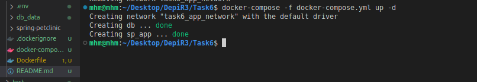
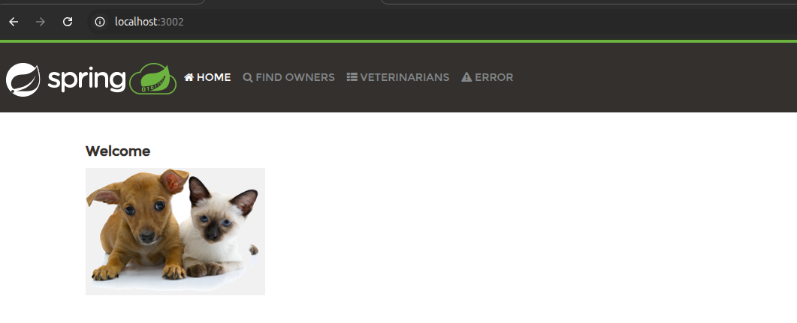
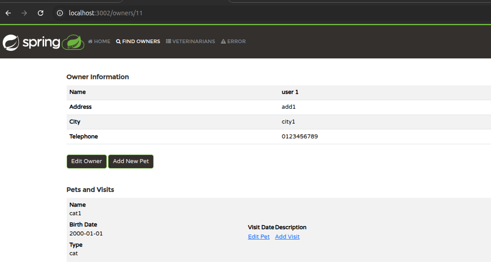

# Task 6 Solution
* __Create spring-petclinic app using docker compose__

## 1. Create `Dockerfile` 
```
FROM eclipse-temurin:17-jdk as builder
WORKDIR /app
COPY ./spring-petclinic .
RUN ./mvnw package -DskipTests

FROM eclipse-temurin:17-jre
WORKDIR /app
COPY --from=builder /app/target/*.jar /app/app.jar
EXPOSE 8080
CMD ["java", "-jar", "app.jar"]
```
## 2. Create `docker-compose.yml`
```
version: "3"
services:
  db:
    image: mysql
    container_name: db
    env_file:
      - .env/db.env
    ports:
      - 3001:3306
    volumes:
      - ./db_data:/var/lib/mysql
    networks:
      - app_network
    healthcheck:
      test: ["CMD", "mysqladmin", "ping", "-h", "localhost"  "-u", "root", "-p$$MYSQL_ROOT_PASSWORD"]
      interval: 15s
      timeout: 5s
      retries: 3
  app:
    build: .
    container_name: sp_app
    env_file:
      - .env/app.env
    ports:
      - 3002:8080
    networks:
      - app_network
    depends_on:
      db:  
        condition: service_healthy
           
networks:
  app_network:
```

## 3. Create the containers using `docker-compose.yml`

`docker-compose -f docker-compose.yml up -d`

* `-f` Specify an alternate compose file (default: docker-compose.yml)

* `up` Create and start containers

* `-d` Run containers in the background and print new container names.







