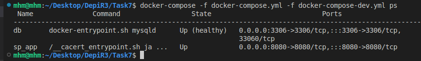

# Task 7 Solution

*  

## 1. Common docker-compose file for development and production. 

`docker-compose.yml`

```
services:
  db:
    container_name: db
    networks:
      - app_network
    restart: always
  
  sp_app:
    build: .
    container_name: sp_app
    ports:
      - "8080:8080"
    depends_on:
      db:
        condition: service_healthy
    networks:
      - app_network
networks:
  app_network:
    name: app_network
    driver: bridge
```

## 2.  development docker-compose file `docker-compose-dev.yml`
```
services:
  db:
    image: mysql
    env_file: ./.env/db-dev.env
    healthcheck:
      test: ["CMD", "mysqladmin", "ping", "-h", "localhost", "-u", "root", "-p$$MYSQL_ROOT_PASSWORD"]
      interval: 10s
      timeout: 5s
      retries: 5
    ports:
      - "3306:3306"
    volumes:
      - ./db_data_dev:/var/lib/mysql
  sp_app:
    env_file: ./.env/app-dev.env
```

### Run the application in development environment.

`docker-compose -f docker-compose.yml -f docker-compose-dev.yml up -d`

`docker-compose -f docker-compose.yml -f docker-compose-dev.yml ps`




## 3. production docker-compose file. `docker-compose-prod.yml`
```
services:
  db:
    image: postgres
    container_name: db
    env_file: ./.env/db-prod.env
    ports:
      - "5432:5432"
    healthcheck: 
      test: ["CMD", "pg_isready", "-U", "postgres"]
      interval: 10s
      timeout: 5s
      retries: 5
    volumes:
      - ./db_data_prod:/var/lib/postgresql/data
  sp_app:
    env_file: ./.env/app-prod.env
```

### Run the application in production environment.

`docker-compose -f docker-compose.yml -f docker-compose-prod.yml up -d`

`docker-compose -f docker-compose.yml -f docker-compose-prod.yml ps`


