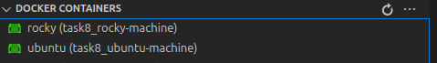
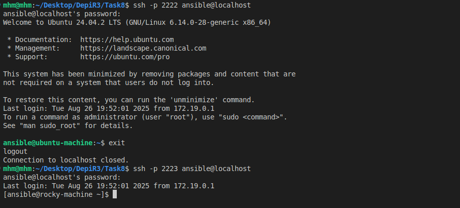
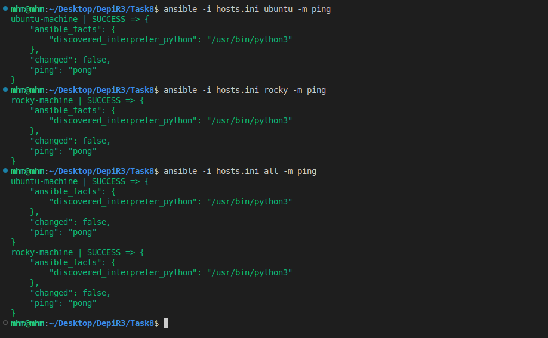

# Task 8 Solution

## Table of Content
1. [Repository Structure](#1-repository-structure)
2. [Install Ansible and Required packeges](#2-install-ansible-and-required-packeges)
3. [Create a Dockerfile for each machine](#3-create-a-dockerfile-for-each-machine)
4. [Build and Run the two machinse using `docker-compose.yml` file](#4-build-and-run-the-two-machinse-using-docker-composeyml-file)
5. [Add the two machines to the `known_hosts` file](#5-add-the-two-machines-to-the-known_hosts-file)
6. [Test the Connection manually](#6-test-the-connection-manually)
7. [Create Inventory file `hosts.ini`](#7-create-inventory-file-hostsini)
8. [Test Ansible connectivity](#8-test-ansible-connectivity)

## 1. Repository Structure
```
└── 📁Task8
    └── 📁Screenshots
        ├── ansible_ping.png
        ├── machines.png
        ├── test_con.png
    ├── .dockerignore
    ├── docker-compose.yml
    ├── Dockerfile.rocky
    ├── Dockerfile.ubuntu
    ├── hosts.ini
    └── README.md
```

## 2. Install Ansible and Required packeges
```bash
sudo apt update
sudo apt install ansible
```
---
## 3. Create a Dockerfile for each machine

> __Dockerfile-ubuntu__
```dockerfile
# Dockerfile to create an Ubuntu-based SSH server for Ansible
FROM ubuntu:latest

# Install necessary packages
RUN apt-get update && apt-get install -y openssh-server sudo python3 python3-pip && \
    apt-get clean && \
    rm -rf /var/lib/apt/lists/*

# Create the SSH directory
RUN mkdir /var/run/sshd

# Create an ansible user with sudo privileges
RUN useradd -m -s /bin/bash ansible && \
    echo 'ansible:ansible' | chpasswd && \
    usermod -aG sudo ansible && \
    echo 'ansible ALL=(ALL) NOPASSWD:ALL' >> /etc/sudoers

# Configure SSH to allow password authentication and root login
RUN sed -i 's/#PasswordAuthentication yes/PasswordAuthentication yes/' /etc/ssh/sshd_config && \
    sed -i 's/#PermitRootLogin prohibit-password/PermitRootLogin yes/' /etc/ssh/sshd_config

RUN echo 'root:root' | chpasswd

EXPOSE 22
# Start the SSH service
CMD ["/usr/sbin/sshd", "-D"]
```

> __Dockerfile-rocky__
```dockerfile
# Dockerfile to create an rocky-based SSH server for Ansible
FROM rockylinux:9

# Install necessary packages
RUN dnf update -y && \
    dnf install -y openssh-server sudo python3 which && \
    dnf clean all

# Configure SSH
RUN ssh-keygen -A

# Create an ansible user with sudo privileges
RUN useradd -m -s /bin/bash ansible && \
    echo 'ansible:ansible' | chpasswd && \
    usermod -aG wheel ansible && \
    echo 'ansible ALL=(ALL) NOPASSWD:ALL' >> /etc/sudoers

# Configure SSH to allow password authentication and root login
RUN sed -i 's/#PasswordAuthentication yes/PasswordAuthentication yes/' /etc/ssh/sshd_config && \
    sed -i 's/#PermitRootLogin yes/PermitRootLogin yes/' /etc/ssh/sshd_config

RUN echo 'root:root' | chpasswd

EXPOSE 22

# Start the SSH service
CMD ["/usr/sbin/sshd", "-D"]
```
---
## 4. Build and Run the two machinse using `docker-compose.yml` file

```yaml
services:
  ubuntu-machine:
    build:
      context: .
      dockerfile: Dockerfile.ubuntu
    container_name: ubuntu
    ports:
      - "2222:22" # Map host port 2222 to container port 22
    hostname: ubuntu-machine
    volumes:
      - ~/.ssh/id_rsa.pub:/home/ansible/.ssh/authorized_keys:ro # Mount the public key for SSH access
    networks:
      - ansible-network

  rocky-machine:
    build:
      context: .
      dockerfile: Dockerfile.rocky
    container_name: rocky
    ports:
      - "2223:22" # Map host port 2223 to container port 22
    volumes:
      - ~/.ssh/id_rsa.pub:/home/ansible/.ssh/authorized_keys:ro # Mount the public key for SSH access
    hostname: rocky-machine
    networks:
      - ansible-network

networks:
  ansible-network:
    name: ansible-network
    driver: bridge
```

`docker-compose -f docker-compose.yml up -d`



---
## 5. Add the two machines to the `known_hosts` file
```bash
ssh-keyscan -p 2222 localhost >> ~/.ssh/known_hosts
ssh-keyscan -p 2223 localhost >> ~/.ssh/known_hosts
```
---
## 6. Test the Connection manually
```bash
ssh -p 2222 ansible@localhost
ssh -p 2223 ansible@localhost
```


---
## 7. Create Inventory file `hosts.ini`

```ini
[ubuntu]
ubuntu-machine ansible_host=localhost ansible_port=2222 ansible_user=ansible ansible_ssh_pass=ansible

[rocky]
rocky-machine ansible_host=localhost ansible_port=2223 ansible_user=ansible ansible_ssh_pass=ansible
```
---
## 8. Test Ansible connectivity
```bash
ansible -i hosts.ini all -m ping
ansible -i hosts.ini ubuntu -m ping
ansible -i hosts.ini rocky -m ping
```
