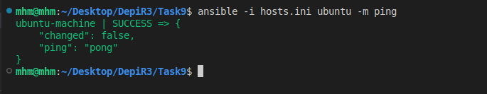
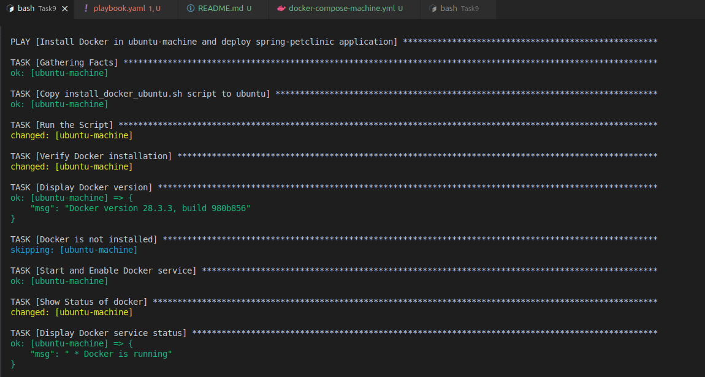
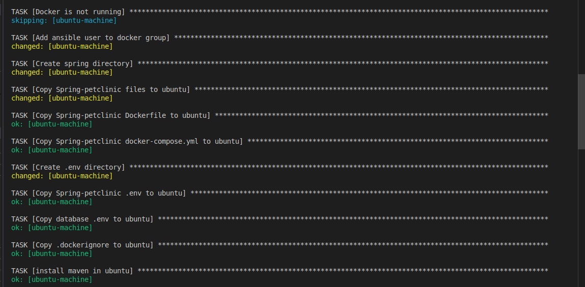
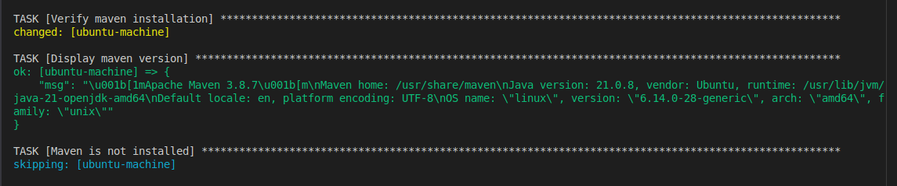
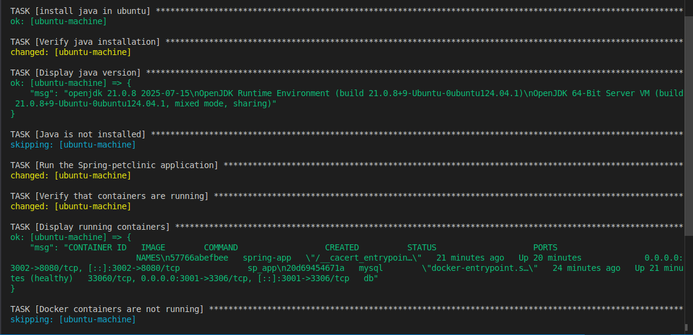
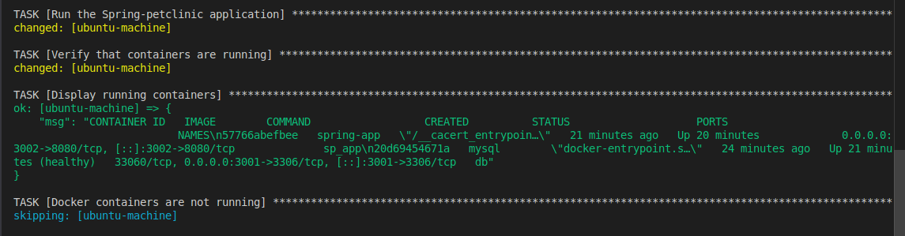
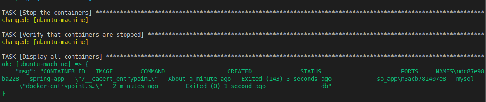
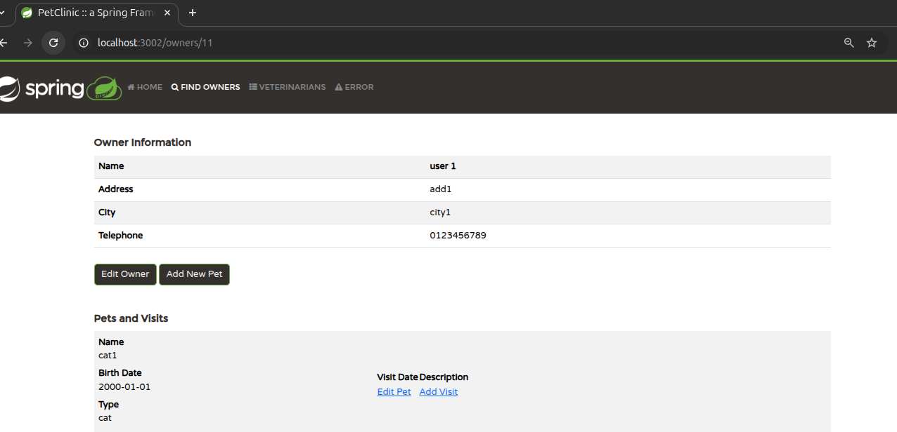

# Task 9 Solution

## Table of Content
1. [Repository Structure](#1-repository-structure)
2. [Install Ansible](#2-install-ansible)
3. [Create a Dockerfile for the managed machine "ubuntu-machine"](#3-create-a-dockerfile-for-the-managed-machine-ubuntu-machine)
4. [Build and Run ubuntu-machine using `docker-compose-machine.yml` file](#4-build-and-run-ubuntu-machine-using-docker-compose-machineyml-file)
5. [Add ubuntu-machine to the `known_hosts` file](#5-add-ubuntu-machine-to-the-known_hosts-file)
6. [Create Inventory file `hosts.ini`](#6-create-inventory-file-hostsini)
7. [Test connectivity](#7-test-connectivity)
8. [Script for installing docker and the required packages on the ubuntu-machine](#8-script-for-installing-docker-and-the-required-packages-on-the-ubuntu-machine)
9. [Create a playbook file `playbook.yaml`](#9-create-a-playbook-file-playbookyaml)
10. [Build the playbook file](#10-build-the-playbook-file)
11. [Access the application from the browser](#11-access-the-application-from-the-browser)

## 1. Repository Structure
```
└── 📁Task9
    └── 📁.env
        ├── app.env
        ├── db.env
    └── 📁Screenshots
    └── 📁spring-petclinic
    ├── .dockerignore
    ├── docker-compose-machine.yml
    ├── docker-compose.yml
    ├── Dockerfile
    ├── Dockerfile.ubuntu
    ├── hosts.ini
    ├── install_docker_ubuntu.sh
    ├── playbook.yaml
    └── README.md
```

## 2. Install Ansible
```bash
sudo apt update
sudo apt install ansible
```
---
## 3. Create a Dockerfile for the managed machine "ubuntu-machine"

> __Dockerfile.ubuntu__
```dockerfile
# Dockerfile to create an Ubuntu-based SSH server for Ansible
FROM ubuntu:latest

# Install necessary packages
RUN apt-get update && apt-get install -y openssh-server sudo python3 python3-pip curl && \
    apt-get clean && \
    rm -rf /var/lib/apt/lists/*

# Create the SSH directory
RUN mkdir /var/run/sshd

# Create an ansible user with sudo privileges
RUN useradd -m -s /bin/bash ansible && \
    echo 'ansible:ansible' | chpasswd && \
    usermod -aG sudo ansible && \
    echo 'ansible ALL=(ALL) NOPASSWD:ALL' >> /etc/sudoers

# Configure SSH to allow password authentication and root login
RUN sed -i 's/#PasswordAuthentication yes/PasswordAuthentication yes/' /etc/ssh/sshd_config && \
    sed -i 's/#PermitRootLogin prohibit-password/PermitRootLogin yes/' /etc/ssh/sshd_config

RUN echo 'root:root' | chpasswd

EXPOSE 22
# Start the SSH service
CMD ["/usr/sbin/sshd", "-D"]
```
---
## 4. Build and Run ubuntu-machine using `docker-compose-machine.yml` file

```yaml

services:
  ubuntu-machine:
    build:
      context: .
      dockerfile: Dockerfile.ubuntu
    container_name: ubuntu
    ports:
      - "2222:22" # Map host port 2222 to container port 22
      - "3002:3002" # Map ubuntu machine port 3002 to sp container port 3002
    hostname: ubuntu-machine
    privileged: true # Enable privileged mode for Docker-in-Docker ,
    volumes:
     # - ./ubuntu:/home/ansible # Mount the ansible user home directory to the host
     # - ./docker_data:/var/lib/docker # Mount the docker data to the host
      - ~/.ssh/id_rsa.pub:/home/ansible/.ssh/authorized_keys:ro # Mount the public key for SSH access
    networks:
      - ansible-network
networks:
  ansible-network:
    name: ansible-network
    driver: bridge
```

`docker-compose -f docker-compose-machine.yml up -d`


---
## 5. Add ubuntu-machine to the `known_hosts` file
```bash
ssh-keyscan -p 2222 localhost >> ~/.ssh/known_hosts
```
---
## 6. Create Inventory file `hosts.ini`

```ini
[ubuntu]
ubuntu-machine ansible_host=localhost ansible_port=2222 ansible_user=ansible ansible_ssh_pass=ansible
```
---
## 7. Test connectivity
```bash
ansible -i hosts.ini ubuntu -m ping
```


## 8. Script for installing docker and the required packages on the ubuntu-machine
```bash
#!/bin/bash

# Add Docker's official GPG key:
#sudo apt update
sudo apt install -y ca-certificates curl
sudo install -m 0755 -d /etc/apt/keyrings
sudo curl -fsSL https://download.docker.com/linux/ubuntu/gpg -o /etc/apt/keyrings/docker.asc
sudo chmod a+r /etc/apt/keyrings/docker.asc

# Add the repository to Apt sources:
echo \
  "deb [arch=$(dpkg --print-architecture) signed-by=/etc/apt/keyrings/docker.asc] https://download.docker.com/linux/ubuntu \
  $(. /etc/os-release && echo "${UBUNTU_CODENAME:-$VERSION_CODENAME}") stable" | \
  sudo tee /etc/apt/sources.list.d/docker.list > /dev/null
sudo apt update

# Install Docker packages.
sudo apt install -y docker-ce docker-ce-cli containerd.io docker-buildx-plugin docker-compose-plugin
```

## 9. Create a playbook file `playbook.yaml`
```yaml
# This playbook installs Docker on the ubuntu-machine and deploys the spring-petclinic application using Docker Compose.
# It also installs Maven and Java, which are required for building and running the Spring application.
# To Stop the containers, comment the task "Run the Spring-petclinic application" and uncomment the task "Stop the containers". 
---
- name: Install Docker and Deploy Spring-Petclinic Application
  hosts: ubuntu
  become: yes
  tasks:
  
  - name: Copy install_docker_ubuntu.sh script to ubuntu
    copy:
      src: ./install_docker_ubuntu.sh
      dest: /home/ansible/install_docker_ubuntu.sh
      owner: ansible 
      group: ansible
      mode: '755'

  - name: Run the Script
    shell: /home/ansible/install_docker_ubuntu.sh
    args:
      executable: /bin/bash

  - name: Verify Docker installation
    command: docker --version
    register: docker_version

  - name: Display Docker version
    debug:
      msg: "{{ docker_version.stdout }}"
    when: docker_version.rc == 0

  - name: Docker is not installed
    debug:
      msg: "Docker is not installed."
    when: docker_version.rc != 0

  - name: Start and Enable Docker service
    service:
      name: docker
      state: started
      enabled: yes
    when: docker_version.rc == 0

  - name: Show Status of docker
    command: service docker status
    register: docker_status

  - name: Display Docker service status
    debug:
      msg: "{{ docker_status.stdout }}"
    when: docker_status.rc == 0

  - name: Docker is not running
    debug:
      msg: " docker is not running "
    when: docker_status.rc != 0

  - name: Add ansible user to docker group
    command: usermod -aG docker ansible
    when: docker_status.rc == 0

  - name: Create spring directory
    file:
      path: /home/ansible/spring
      state: directory
      owner: ansible
      group: ansible
      mode: '644'

  - name: Copy Spring-petclinic files to ubuntu
    copy:
      src: ./spring-petclinic
      dest: /home/ansible/spring
      owner: ansible
      group: ansible
      mode: '644'

  - name: Copy Spring-petclinic Dockerfile to ubuntu
    copy:
      src: ./Dockerfile
      dest: /home/ansible/spring/Dockerfile
      owner: ansible
      group: ansible
      mode: '644'

  - name: Copy Spring-petclinic docker-compose.yml to ubuntu
    copy:
      src: ./docker-compose.yml
      dest: /home/ansible/spring/docker-compose.yml
      owner: ansible
      group: ansible
      mode: '644'

  - name: Create .env directory
    file:
      path: /home/ansible/spring/.env
      state: directory  
      owner: ansible
      group: ansible
      mode: '644'

  - name: Copy Spring-petclinic environment variables to ubuntu
    copy:
      src: ./.env/app.env
      dest: /home/ansible/spring/.env/app.env
      owner: ansible
      group: ansible
      mode: '644'

  - name: Copy database environment variables to ubuntu
    copy:
      src: ./.env/db.env
      dest: /home/ansible/spring/.env/db.env
      owner: ansible
      group: ansible
      mode: '644'

  - name: Copy .dockerignore to ubuntu
    copy:
      src: ./.dockerignore
      dest: /home/ansible/spring/.dockerignore
      owner: ansible
      group: ansible
      mode: '644'

  - name: install maven in ubuntu
    apt:
      name: maven
      state: present

  - name: Verify maven installation
    command: mvn --version
    register: maven_check

  - name: Display maven version
    debug:
      msg: "{{ maven_check.stdout }}"
    when: maven_check.rc == 0

  - name: Maven is not installed
    debug:
      msg: "Maven is not installed."
    when: maven_check.rc != 0

  - name: install java in ubuntu
    apt:
      name: openjdk-17-jdk
      state: present
      
  - name: Verify java installation
    command: java --version
    register: java_version

  - name: Display java version
    debug:
      msg: "{{ java_version.stdout }}"
    when: java_version.rc == 0

  - name: Java is not installed
    debug:
      msg: "Java is not installed."
    when: java_version.rc != 0 
  - name: Run the Spring-petclinic application
    command: docker compose -f /home/ansible/spring/docker-compose.yml up -d

  - name: Verify that containers are running
    command: docker ps
    register: docker_ps

  - name: Display running containers 
    debug:
      msg: "{{ docker_ps.stdout }}"
    when: docker_ps.rc == 0

  - name: Docker containers are not running
    debug:
      msg: "Docker containers are not running."
    when: docker_ps.rc != 0

  #- name: Stop the containers
   # command: docker compose -f /home/ansible/spring/docker-compose.yml stop
   # register: docker_stop

  #- name: Verify that containers are stopped
   # command: docker ps -a
   # register: docker_ps_a

  #- name: Display all containers
   # debug:
    #  msg: "{{ docker_ps_a.stdout }}"
    #when: docker_stop.rc == 0
```
## 10. Build the playbook file

`ansible-playbook -i hosts.ini playbook.yaml`













## 11. Access the application from the browser

* use **`localhost:3002`**

* **`host`** will forward the request to the **`ubuntu-machine`** "**it is a container**" then ubuntu-machine forwards the request to **`spring-petclinic container`** which forwards the request to port **`8080`**


